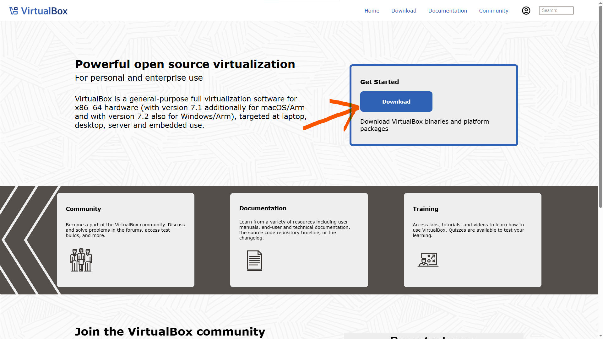
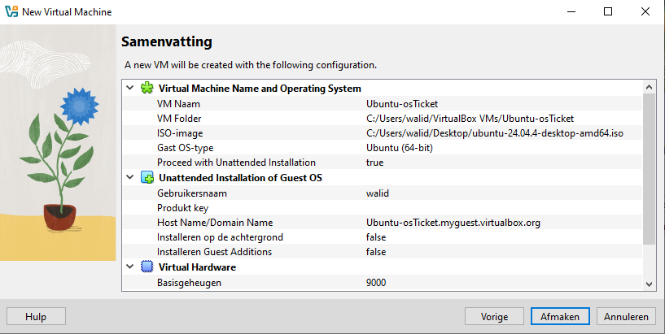

<p align="center">


</p>

<h1>osTicket Help Desk Lab [Ubuntu / VirtualBox]</h1>

This lab demonstrates how to deploy and configure a helpdesk ticketing system using osTicket in a virtualized environment.

The purpose of this project is to simulate a real-world IT support environment where users submit tickets and helpdesk agents resolve issues.

<h2>Environments and Technologies Used</h2>
<p>
  
  
  
</p>

- Oracle VirtualBox (Virtual Machines)
- osTicket (Ticket System)
- Mysql
- PHP

<h2>Operating Systems Used </h2>

- Linux (Ubuntu)

<h2>High-Level Deployment and Configuration Steps</h2>

> [!IMPORTANT]
> Each step includes written instructions followed by a screenshot.
Expand the See screenshots section to view the images.

> [!IMPORTANT]
> Make Sure You Have Enable Copy and Paste in Oracle VirtualBox

Settings > General > Advanced > Set Both Options To Bidirectional 
<details><summary>See screenshots</summary>


</details>

<h3>Step 1 — Downloading Ubuntu Operating System & Oracle VirtualBox</h3>

[Oracle VirtualBox](https://www.virtualbox.org)
<details><summary>See screenshots</summary>

</details>

[Ubuntu](https://ubuntu.com/download/desktop)
<details><summary>See screenshots</summary>

</details>

<h3>Step 2 — Setting Up The Virtual Machine</h3>
Lets setup our virtual machine
Open Oracle VirtualBox > New > Pick your vm name (can be anything) > Select your iso image (ubuntu os you downloaded) > Next >  Pick a Username & Password you gonna use to login in to ubuntu > Next > I Suggest to pick 9000 Memory, 5 Cpus, 25 or 30 gb of disk storage > Next > Summury of your vm if everything is okay press on finish

<details><summary>See screenshots</summary>



</details> 

<h3>Step 3 — Setting Up osTicket in your ubuntu vm</h3>
Login & Update | After Ubuntu Is Installed

```
sudo apt update && sudo apt upgrade -y
```

<h3>Step 4 — Install LAMP Stack</h3>
osTicket needs:

Apache

MySQL / MariaDB

PHP

```
sudo apt install apache2 -y
```

```
sudo systemctl enable apache2
sudo systemctl start apache2
```

```
http://localhost
```

<h3>Step 5 — Install MariaDB</h3>

```
sudo apt install mariadb-server -y
```

Secure it:

```
sudo mysql_secure_installation
```

Say:

Remove anonymous users → Yes

Disallow root remote login → Yes

Remove test DB → Yes

<h3>Step 6 Install PHP</h3>

```
sudo apt install php php-mysql php-imap php-apcu php-intl php-gd php-mbstring php-xml php-cli php-curl unzip -y
```

```
sudo systemctl restart apache2
```

<h3>Step 7 — Database Setup</h3>

Login:
```
sudo mysql -u root -p
```

Create DB:
```
CREATE DATABASE osticket;
CREATE USER 'osticketuser'@'localhost' IDENTIFIED BY 'StrongPassword';
GRANT ALL PRIVILEGES ON osticket.* TO 'osticketuser'@'localhost';
FLUSH PRIVILEGES;
EXIT;
```
<h3>Step 8 — Install osTicket</h3>

Download latest:
```
cd /tmp
wget https://github.com/osTicket/osTicket/releases/download/v1.18.1/osTicket-v1.18.1.zip
unzip osTicket-v1.18.1.zip
```

Move to web root:
```
sudo mv upload /var/www/html/osticket
```

Set permissions:
```
sudo chown -R www-data:www-data /var/www/html/osticket
sudo chmod -R 755 /var/www/html/osticket
```
<h3>Step 9 - Configure Apache</h3>

Create config:
```
sudo nano /etc/apache2/sites-available/osticket.conf
```
```
<VirtualHost *:80>
    ServerAdmin admin@localhost
    DocumentRoot /var/www/html/osticket
    ServerName osticket.local

    <Directory /var/www/html/osticket>
        Options Indexes FollowSymLinks
        AllowOverride All
        Require all granted
    </Directory>

    ErrorLog ${APACHE_LOG_DIR}/osticket_error.log
    CustomLog ${APACHE_LOG_DIR}/osticket_access.log combined
</VirtualHost>
```

Enable:
```
sudo a2ensite osticket.conf
sudo a2enmod rewrite
sudo systemctl restart apache2
```
Final File Permission:
```
sudo cp /var/www/html/osticket/include/ost-sampleconfig.php /var/www/html/osticket/include/ost-config.php
sudo chmod 666 /var/www/html/osticket/include/ost-config.php
```
<h3>Step 10 — Web Installer</h3>

Open browser in Ubuntu VM:
```
http://localhost/osticket/setup
```
Fill:

Field	Value
Helpdesk Name	Your Company
Email	admin@email.com

DB Name	osticket
DB User	osticketuser
DB Pass	StrongPassword

Click Install Now

After Install (IMPORTANT):

Lock config:
```
sudo chmod 644 /var/www/html/osticket/include/ost-config.php
```
Delete setup folder:
```
sudo rm -rf /var/www/html/osticket/setup/
```

## 🎫 Ticket Workflow Demonstration

After installing osTicket, the system was tested by simulating a real support request.

The workflow demonstrates how a user submits a ticket and how an administrator manages and resolves it through the osTicket dashboard.

### User Submits a Ticket

A user accesses the helpdesk portal and submits a support request.

<details><summary>See screenshots</summary>


</details>

The user fills out the ticket form including:

- Name
- Email address
- Help topic
- Description of the issue

Once submitted, the ticket is stored in the osTicket database and becomes visible to helpdesk agents.

### Admin Dashboard

The ticket appears in the osTicket agent dashboard where support staff can review and manage incoming requests.

<details><summary>See screenshots</summary>


</details>

Support agents can:

- View ticket details
- Assign tickets to staff members
- Respond to the user
- Update ticket status

### Configure Roles
Admin Panel -> Agents -> Roles
<details><summary>See screenshots</summary>


</details>

### Configure Departments
Admin Panel -> Agents -> Departments
<details><summary>See screenshots</summary>


</details>
