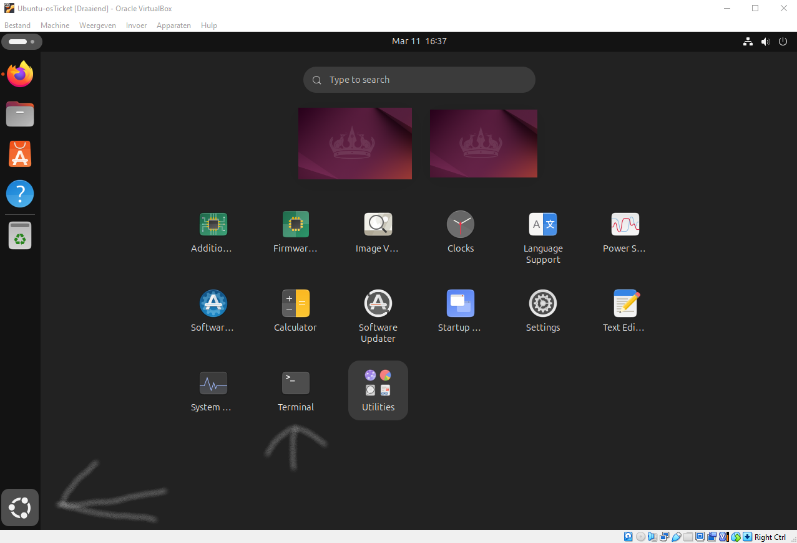

<p align="center">


</p>

<h1>osTicket Help Desk Lab [Ubuntu / VirtualBox]</h1>

This lab demonstrates how to deploy and configure a helpdesk ticketing system using osTicket in a virtualized environment.

The purpose of this project is to simulate a real-world IT support environment where users submit tickets and helpdesk agents resolve issues.

<h2>Environments and Technologies Used</h2>
<p>
  
  
  
</p>

- Oracle VirtualBox (Virtual Machines)
- osTicket (Ticket System)
- Mysql
- PHP

<h2>Operating Systems Used </h2>

- Linux (Ubuntu)

<h2>High-Level Deployment and Configuration Steps</h2>

> [!IMPORTANT]
> Each step includes written instructions followed by a screenshot.
Expand the See screenshots section to view the images.

> [!IMPORTANT]
> Make Sure You Have Enabled Copy and Paste in Oracle VirtualBox

Settings > General > Advanced > Set Both Options To Bidirectional 
<details><summary>See screenshots</summary>


</details>

<h3> 1. Downloading Ubuntu Operating System & Oracle VirtualBox</h3>

In this step, we download the required software to create our virtual environment.
We install Oracle VM VirtualBox, which allows us to run virtual machines on our computer, and download the Ubuntu operating system that will host the help-desk system.

Ubuntu will be used as the server where the osTicket application and its dependencies will be installed.

[Oracle VirtualBox](https://www.virtualbox.org)
<details><summary>See screenshots</summary>

</details>

[Ubuntu](https://ubuntu.com/download/desktop)
<details><summary>See screenshots</summary>

</details>

<h3> 2. Setting Up The Virtual Machine</h3>
Lets setup our virtual machine:

After installing VirtualBox and downloading Ubuntu, we create and configure a new virtual machine.
This virtual machine provides an isolated environment where we can safely install and configure the server software required for the osTicket system.

Once the VM is created, Ubuntu is installed and we can begin configuring the server environment.

(ISO image is ubuntu you downloaded before)


<details><summary>See screenshots</summary>


</details> 

<h3> 3. Setting Up osTicket in your ubuntu vm</h3>

After logging into the Ubuntu virtual machine, the system packages are updated to ensure all installed software is current and secure.

Updating the system helps prevent compatibility issues before installing additional services required for the help-desk platform.

Show Apps>Terminal

<details><summary>See screenshots</summary>

</details> 

```
sudo apt update && sudo apt upgrade -y
```

<h3>4. Install LAMP Stack</h3>

The osTicket application requires a web server, database server, and PHP runtime environment.
These components together form a LAMP stack, which consists of:

* Apache (Web Server)

* MySQL/MariaDB (Database Server)

* PHP (Server-side scripting language)

First, we install the Apache HTTP Server which will host the osTicket website.

```
sudo apt install apache2 -y
```

```
sudo systemctl enable apache2
sudo systemctl start apache2
```

You can verify Apache is running by visiting:

```
http://localhost
```

<h3> 5. Install MariaDB</h3>

Next, we install MariaDB, which will store all osTicket data such as users, tickets, and system configurations.

```
sudo apt install mariadb-server -y
```

After installation, the database server is secured using the built-in security script.

```
sudo mysql_secure_installation
```

During this setup we:

* Remove anonymous users

* Disable remote root login

* Remove the test database

* These steps improve the security of the database server.

<h3> 6. Install PHP</h3>

Since osTicket is written in PHP, we must install PHP along with several required extensions that allow the application to function properly.

```
sudo apt install php php-mysql php-imap php-apcu php-intl php-gd php-mbstring php-xml php-cli php-curl unzip -y
```

After installation, we restart the Apache service to ensure PHP is loaded correctly.

```
sudo systemctl restart apache2
```

<h3> 7. Database Setup</h3>

In this step, we create a database that osTicket will use to store its data.

First, log into the MariaDB database server:
```
sudo mysql -u root -p
```

Then create the database and a dedicated user for osTicket:
```
CREATE DATABASE osticket;
CREATE USER 'osticketuser'@'localhost' IDENTIFIED BY 'StrongPassword';
GRANT ALL PRIVILEGES ON osticket.* TO 'osticketuser'@'localhost';
FLUSH PRIVILEGES;
EXIT;
```
This ensures osTicket has permission to read and write data to the database.

<h3> 8. Install osTicket</h3>

Now we download and install osTicket.
Download the latest release:
```
cd /tmp
wget https://github.com/osTicket/osTicket/releases/download/v1.18.1/osTicket-v1.18.1.zip
unzip osTicket-v1.18.1.zip
```

Move the files to the Apache web directory:
```
sudo mv upload /var/www/html/osticket
```

Set the correct file permissions so the web server can access the application:
```
sudo chown -R www-data:www-data /var/www/html/osticket
sudo chmod -R 755 /var/www/html/osticket
```
<h3> 9. Configure Apache</h3>

In this step we configure the Apache HTTP Server so it can properly serve the osTicket application.

First, we create a new Apache virtual host configuration file that defines where the osTicket application is located and how Apache should handle requests to it.
```
sudo nano /etc/apache2/sites-available/osticket.conf
```

Inside this configuration file we define the document root, server settings, and directory permissions so Apache can access the osTicket installation.

```
<VirtualHost *:80>
    ServerAdmin admin@localhost
    DocumentRoot /var/www/html/osticket
    ServerName osticket.local

    <Directory /var/www/html/osticket>
        Options Indexes FollowSymLinks
        AllowOverride All
        Require all granted
    </Directory>

    ErrorLog ${APACHE_LOG_DIR}/osticket_error.log
    CustomLog ${APACHE_LOG_DIR}/osticket_access.log combined
</VirtualHost>
```

Next, we enable the new site configuration and activate the Apache rewrite module, which allows osTicket to properly handle URLs and routing.
```
sudo a2ensite osticket.conf
sudo a2enmod rewrite
sudo systemctl restart apache2
```
Finally, we prepare the osTicket configuration file by copying the sample configuration file and adjusting its permissions so the web installer can write the necessary settings during installation.
```
sudo cp /var/www/html/osticket/include/ost-sampleconfig.php /var/www/html/osticket/include/ost-config.php
sudo chmod 666 /var/www/html/osticket/include/ost-config.php
```
This completes the Apache configuration and prepares the system for the osTicket web installer.

<h3> 10. Web Installer</h3>

The final step is to complete the osTicket installation through the web interface.

Open a browser in the Ubuntu VM and navigate to:
```
http://localhost/osticket/setup
```
Fill in the required information including the help desk name, administrator email, and database credentials created earlier.

Once the installation is complete, secure the configuration file and remove the setup directory:

```
sudo chmod 644 /var/www/html/osticket/include/ost-config.php
sudo rm -rf /var/www/html/osticket/setup/
```
At this point, the osTicket help desk system is fully installed and ready to manage support tickets.

## Ticket Workflow Demonstration

After installing osTicket, the system was tested by simulating a real support request.

The workflow demonstrates how a user submits a ticket and how an administrator manages and resolves it through the osTicket dashboard.

### User Submits a Ticket

A user accesses the helpdesk portal and submits a support request.

<details><summary>See screenshots</summary>


</details>

The user fills out the ticket form including:

- Name
- Email address
- Help topic
- Description of the issue

Once submitted, the ticket is stored in the osTicket database and becomes visible to helpdesk agents.

### Admin Dashboard

The ticket appears in the osTicket agent dashboard where support staff can review and manage incoming requests.

<details><summary>See screenshots</summary>


</details>

Support agents can:

- View ticket details
- Assign tickets to staff members
- Respond to the user
- Update ticket status

### Configure Roles
Admin Panel -> Agents -> Roles
<details><summary>See screenshots</summary>


</details>

### Configure Departments
Admin Panel -> Agents -> Departments
<details><summary>See screenshots</summary>


</details>

### Configure Teams
Admin Panel -> Agents -> Teams (Pull Agents from different Departments)
<details><summary>See screenshots</summary>


</details>

Allow anyone to create tickets
Admin Panel -> Settings -> User Settings (UNCHECK: unregistered users can create tickets)
Registration Required: Require registration and login to create tickets

### Configure Agents (workers)
Admin Panel -> Agents -> Add New
- Jane (Dept: SysAdmins)
- John (Dept: Support)

### Configure Users (customers)
Agent Panel -> Users -> Add New
- Karen
- Ken

### Configure SLA
Admin Panel -> Manage -> SLA
- Sev-A (Grace Period: 1 hour, Schedule: 24/7)
- Sev-B (Grace Period: 4 hours, Schedule: 24/7)
- Sev-C (Grace Period: 8 hours, Business Hours)
<details><summary>See screenshots</summary>


</details>

### Configure Help Topics (For when users create a ticket)
Admin Panel -> Manage -> Help Topics
- Business Critical Outage
- Personal Computer Issues
- Equipment Request
- Password Reset
- Other
<details><summary>See screenshots</summary>


</details>
