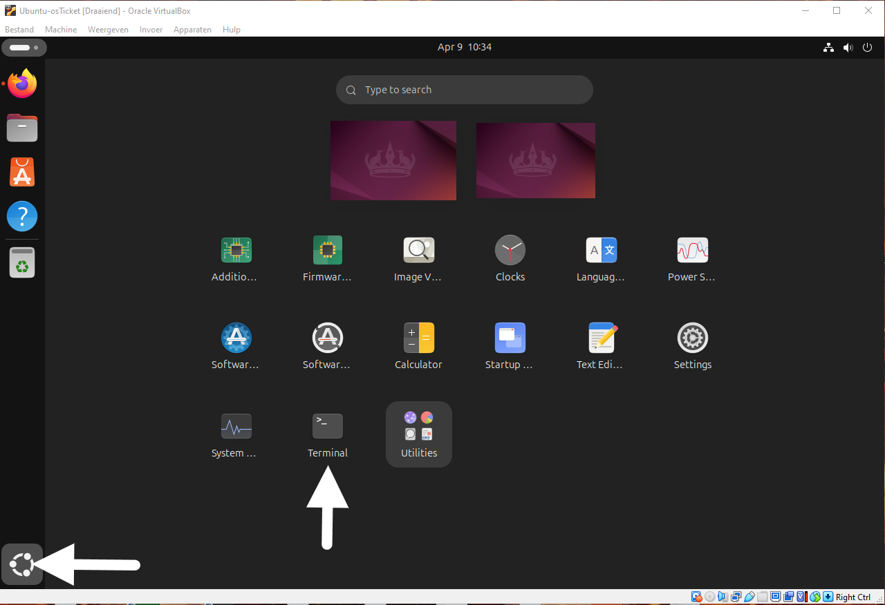
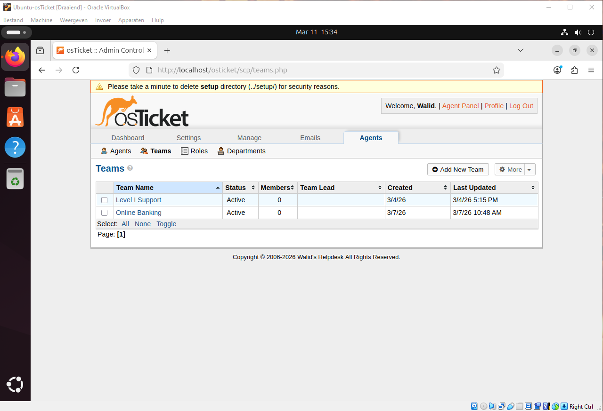

<p align="center">


</p>

<h1>osTicket Help Desk Lab [Ubuntu / VirtualBox]</h1>

This lab demonstrates how to deploy and configure a helpdesk ticketing system using osTicket in a virtualized environment.

The purpose of this project is to simulate a real-world IT support environment where users submit tickets and helpdesk agents resolve issues.

<h2>Environments and Technologies Used</h2>
<p>
  
  
  
</p>

- Oracle VirtualBox (Virtual Machines)
- osTicket (Ticket System)
- Mysql
- PHP

<h2>Operating Systems Used </h2>

- Linux (Ubuntu)

<h2>High-Level Deployment and Configuration Steps</h2>

> [!IMPORTANT]
> Each step includes written instructions followed by a screenshot.
Expand the See screenshots section to view the images.

> [!IMPORTANT]
> Make Sure You Have Enabled Copy and Paste in Oracle VirtualBox

Settings > General > Advanced > Set Both Options To Bidirectional 
<details><summary>See screenshots</summary>


</details>

<h3> 1. Downloading Ubuntu Operating System & Oracle VirtualBox</h3>

I started by downloading Oracle VM VirtualBox (the virtualization software) and the Ubuntu Desktop ISO file.
VirtualBox allows me to create an isolated virtual machine (VM) on my computer. Ubuntu is used as the operating system because it is stable, free, and widely used for server deployments.
This step prepares the foundation — without a virtual machine and OS, I cannot install any server software.

[Oracle VirtualBox](https://www.virtualbox.org)
<details><summary>See screenshots</summary>

</details>

[Ubuntu](https://ubuntu.com/download/desktop)
<details><summary>See screenshots</summary>

</details>

<h3> 2. Setting Up The Virtual Machine</h3>
I created a new virtual machine in VirtualBox, allocated CPU, RAM (at least 2–4 GB recommended), and hard disk space. Then I attached the Ubuntu ISO and installed Ubuntu inside the VM. After installation, I entered a user name and password to use in the Ubuntu OS to log in. This gives me a clean, dedicated environment to install and configure osTicket without affecting my main computer.

<details><summary>See screenshots</summary>


</details> 

<h3> 3. Setting Up osTicket in your ubuntu vm</h3>

Once inside the Ubuntu VM, I ran the following command to update the system:
```
sudo apt update && sudo apt upgrade -y
```
This command refreshes the package list and installs the latest updates and security patches.
Why? A fully updated system reduces errors and security risks during the installation of Apache, MariaDB, PHP, and osTicket.

<h3>4. Install LAMP Stack</h3>

I installed the Apache web server, which is the first part of the LAMP stack:
```
sudo apt install apache2 -y
sudo systemctl enable apache2
sudo systemctl start apache2
```
```apt install apache2 -y``` installs the Apache web server.<br/>
```enable makes Apache start``` automatically on boot.<br/>
```start``` launches it immediately.<br/>

I verified it by opening Firefox inside the VM and visiting http://localhost. The default Apache welcome page appeared, confirming the web server was working.

First, we install the Apache HTTP Server which will host the osTicket website.

How To Access The Terminal:
Show All Apps > Terminal (See Image Below)
<details><summary>See screenshots</summary>

</details> 

This command installs the Apache2 web server.
sudo gives administrator rights, apt install downloads and installs the package from Ubuntu’s repositories, and -y automatically confirms all prompts.
Apache is the web server that will host osTicket and serve its pages to the browser. Without it, the application cannot be accessed via a web browser.

```
sudo apt install apache2 -y
```

These two commands manage the Apache web server service.
systemctl enable apache2 makes Apache start automatically every time the Ubuntu VM boots.
systemctl start apache2 starts the Apache service immediately.
Together, they ensure the web server is running now and will start on its own after any reboot. Without these commands, Apache would not run automatically.

```
sudo systemctl enable apache2
sudo systemctl start apache2
```

After starting Apache, I opened Firefox inside the Ubuntu VM and typed http://localhost in the address bar.
localhost is a special hostname that refers to the local machine (equivalent to IP address 127.0.0.1).
This step tests whether Apache is correctly installed and running by loading the default welcome page. If the page appears, it confirms the web server is working and ready to host osTicket.

You can verify Apache is running by visiting:
```
http://localhost
```

<h3> 5. Install MariaDB</h3>

Next, i installed MariaDB, which will store all osTicket data such as users, tickets, and system configurations.

This command installs the MariaDB database server.
sudo gives administrator rights, apt install downloads the package from Ubuntu’s repositories, and -y automatically confirms all prompts.
MariaDB is the database engine where osTicket will store all tickets, users, settings, and attachments. Without it, osTicket has no place to save its data.

```
sudo apt install mariadb-server -y
```

After installation, the database server is secured using the built-in security script.

This command runs an interactive security script for MariaDB.
It removes anonymous users, disables remote root login, deletes the test database, and reloads privilege tables.
I answered Y to all questions to harden the database. This step is important because a fresh MariaDB installation has insecure default settings that could be exploited.
```
sudo mysql_secure_installation
```

During this setup we:

* Remove anonymous users

* Disable remote root login

* Remove the test database

* These steps improve the security of the database server.

<h3> 6. Install PHP</h3>

osTicket is built using PHP, so I installed PHP and the necessary extensions:

This command installs PHP 8.x and all the required extensions for osTicket.
sudo gives admin rights, apt install downloads the packages, and -y auto-confirms prompts.
These extensions provide essential features: database connection (php-mysql), email handling (php-imap), image processing (php-gd), multilingual support (php-intl), and more. Without them, many osTicket features would not work.
```
sudo apt install php php-mysql php-imap php-apcu php-intl php-gd php-mbstring php-xml php-cli php-curl unzip -y
```

This command restarts the Apache web server.
systemctl restart stops the service and starts it again immediately.
This is necessary after installing PHP and its extensions so Apache can load the new PHP modules. Without restarting, the newly installed PHP features would not work.
```
sudo systemctl restart apache2
```

<h3> 7. Database Setup</h3>

In this step, we create a database that osTicket will use to store its data.

This command logs into the MariaDB database server as the root user.
sudo runs the command with administrator rights, -u root specifies the username, and -p prompts for the password.
This step is necessary to access the MariaDB shell so I can create the database and user for osTicket.
I logged into MariaDB:
```
sudo mysql -u root -p
```

These commands create a dedicated database and user for osTicket.
Then I created a dedicated database and user for osTicket:
CREATE DATABASE makes the empty database.
CREATE USER and GRANT set up a secure user with proper permissions only on the osticket database.
FLUSH PRIVILEGES applies the changes immediately.
```
CREATE DATABASE osticket;
CREATE USER 'osticketuser'@'localhost' IDENTIFIED BY 'StrongPassword';
GRANT ALL PRIVILEGES ON osticket.* TO 'osticketuser'@'localhost';
FLUSH PRIVILEGES;
EXIT;
```
This creates a separate database called osticket and a user with limited permissions (better for security than using the root user).

<h3> 8. Install osTicket</h3>

Now we download and install osTicket.
I downloaded the official osTicket files:
cd /tmp changes the current directory to the temporary folder (a safe place to download files).
wget downloads the official osTicket zip file from GitHub.
unzip extracts the downloaded file, creating an upload folder containing osTicket.
```
cd /tmp
wget https://github.com/osTicket/osTicket/releases/download/v1.18.1/osTicket-v1.18.1.zip
unzip osTicket-v1.18.1.zip
```

Move the files to the Apache web directory:
This command moves the extracted upload folder to Apache’s web root directory and renames it to osticket.
sudo gives administrator rights, mv moves and renames the folder in one step.
This places the osTicket application files where Apache can serve them to the browser. Without this step, the application would not be accessible via the web.
```
sudo mv upload /var/www/html/osticket
```

chown -R changes the owner of all files and folders to www-data (the user Apache runs as).
chmod -R 755 sets read and execute permissions for everyone, but write permission only for the owner.
These commands are critical so Apache can read and serve the osTicket files. Without correct permissions, you will get "403 Forbidden" errors.
Then I set proper ownership and permissions:
```
sudo chown -R www-data:www-data /var/www/html/osticket
sudo chmod -R 755 /var/www/html/osticket
```
This places the osTicket files in Apache’s web directory and gives the web server the right permissions to access them.

<h3> 9. Configure Apache</h3>

In this step we configure the Apache HTTP Server so it can properly serve the osTicket application.

First, we create a new Apache virtual host configuration file that defines where the osTicket application is located and how Apache should handle requests to it.

This command opens the nano text editor with administrator privileges (sudo) to create a new configuration file in Apache’s sites-available directory.
The file /etc/apache2/sites-available/osticket.conf is where we define a custom "virtual host" for osTicket.
```
sudo nano /etc/apache2/sites-available/osticket.conf
```

Inside this configuration file we define the document root, server settings, and directory permissions so Apache can access the osTicket installation.
Without this file, Apache would not know how to properly serve the osTicket application, and accessing it through the browser would likely fail or show incorrect behavior.
After opening the file with nano, I pasted the following configuration, saved it (Ctrl + O → Enter), and exited (Ctrl + X):
```
<VirtualHost *:80>
    ServerAdmin admin@localhost
    DocumentRoot /var/www/html/osticket
    ServerName osticket.local

    <Directory /var/www/html/osticket>
        Options Indexes FollowSymLinks
        AllowOverride All
        Require all granted
    </Directory>

    ErrorLog ${APACHE_LOG_DIR}/osticket_error.log
    CustomLog ${APACHE_LOG_DIR}/osticket_access.log combined
</VirtualHost>
```

After creating and editing the virtual host file, I enabled the new site and the required Apache module with the following commands:
```
sudo a2ensite osticket.conf
sudo a2enmod rewrite
sudo systemctl restart apache2
```
These three commands complete the Apache configuration. They make sure Apache knows about osTicket, supports its URL structure, and applies all the changes we made.
After running these commands, I also prepared the osTicket configuration file so the web installer could write the database settings:

```
sudo cp /var/www/html/osticket/include/ost-sampleconfig.php /var/www/html/osticket/include/ost-config.php
sudo chmod 666 /var/www/html/osticket/include/ost-config.php
```
This completes the Apache configuration and prepares the system for the osTicket web installer.

<h3> 10. Web Installer</h3>

The final step is to complete the osTicket installation through the web interface.

After configuring Apache, I opened Firefox inside the Ubuntu VM and navigated to the following URL:
http://localhost/osticket/setup
```
http://localhost/osticket/setup
```
This URL launches osTicket’s official installation wizard in the browser. The wizard collects information such as the helpdesk name, administrator account details, and database credentials, then creates all the necessary tables in the MariaDB database and writes the configuration file.
If everything was configured correctly in the previous steps (Apache, PHP, database, file permissions, and virtual host), the setup page should load successfully. If it shows an error, it usually indicates a problem with permissions, database connection, or Apache configuration.

Fill in the required information including the help desk name, administrator email, and database credentials created earlier.

Once the installation is complete, secure the configuration file and remove the setup directory:

```
sudo chmod 644 /var/www/html/osticket/include/ost-config.php
sudo rm -rf /var/www/html/osticket/setup/
```
At this point, the osTicket help desk system is fully installed and ready to manage support tickets.

## Ticket Workflow Demonstration

After installing osTicket, the system was tested by simulating a real support request.

The workflow demonstrates how a user submits a ticket and how an administrator manages and resolves it through the osTicket dashboard.

### User Submits a Ticket

A user accesses the helpdesk portal and submits a support request.

<details><summary>See screenshots</summary>


</details>

The user fills out the ticket form including:

- Name
- Email address
- Help topic
- Description of the issue

Once submitted, the ticket is stored in the osTicket database and becomes visible to helpdesk agents.

### Admin Dashboard

The ticket appears in the osTicket agent dashboard where support staff can review and manage incoming requests.

<details><summary>See screenshots</summary>


</details>

Support agents can:

- View ticket details
- Assign tickets to staff members
- Respond to the user
- Update ticket status

### Configure Roles
Admin Panel -> Agents -> Roles
<details><summary>See screenshots</summary>


</details>

### Configure Departments
Admin Panel -> Agents -> Departments
<details><summary>See screenshots</summary>


</details>

### Configure Teams
Admin Panel -> Agents -> Teams (Pull Agents from different Departments)
<details><summary>See screenshots</summary>


</details>

Allow anyone to create tickets
Admin Panel -> Settings -> User Settings (UNCHECK: unregistered users can create tickets)
Registration Required: Require registration and login to create tickets

### Configure Agents (workers)
Admin Panel -> Agents -> Add New
- Jane (Dept: SysAdmins)
- John (Dept: Support)

### Configure Users (customers)
Agent Panel -> Users -> Add New
- Karen
- Ken

### Configure SLA
Admin Panel -> Manage -> SLA
- Sev-A (Grace Period: 1 hour, Schedule: 24/7)
- Sev-B (Grace Period: 4 hours, Schedule: 24/7)
- Sev-C (Grace Period: 8 hours, Business Hours)
<details><summary>See screenshots</summary>


</details>

### Configure Help Topics (For when users create a ticket)
Admin Panel -> Manage -> Help Topics
- Business Critical Outage
- Personal Computer Issues
- Equipment Request
- Password Reset
- Other
<details><summary>See screenshots</summary>


</details>
